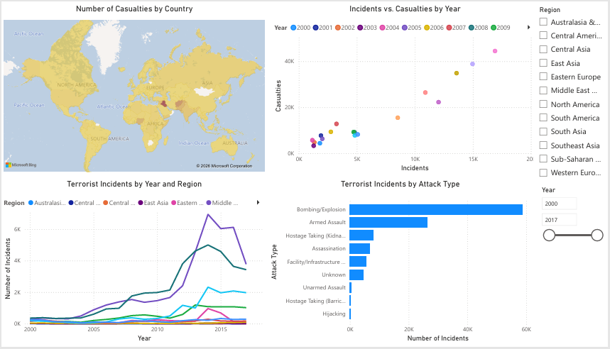
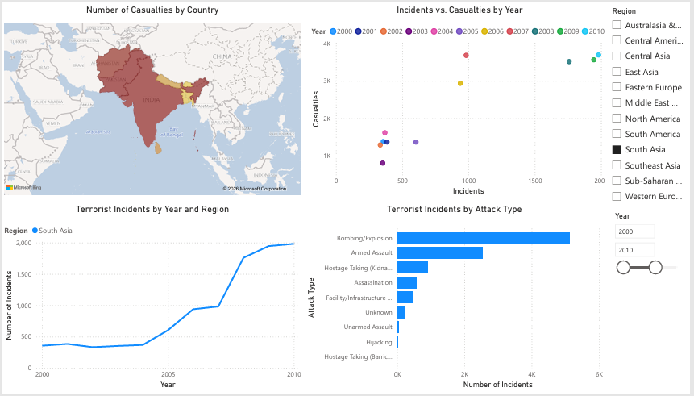

# Global Terrorism Database — Exploratory Data Analysis (2000–2017)

An exploratory data analysis of the Global Terrorism Database, examining incident
trends, the relationship between incidents and casualties, attack method patterns, and
geographic distribution across over 111,000 recorded incidents worldwide.

## Dataset

## Dataset

- **Original dataset:** [Global Terrorism Database](https://www.start.umd.edu/gtd/) — maintained by the National Consortium for the Study of Terrorism and Responses to Terrorism (START), University of Maryland.
- **Scoped subset (this project):** [Global Terrorism Database — 2000–2017 Subset (Cleaned & Scoped)](https://www.kaggle.com/datasets/rahulagrawal1025/global-terrorism-database-20002017-subset) — filtered to 2000–2017 and reduced from 136 to 17 relevant columns. No values altered.

## Tools

Python, pandas, matplotlib, seaborn, folium, Jupyter Notebook, Power BI

## Approach

This analysis was structured around four specific questions, framed from the
perspective of a security/defense analyst:

1. How has the number of terrorist incidents changed over time, and do specific regions
   diverge from the global trend?
2. Are the number of incidents and number of casualties correlated? Are there outliers?
3. What are the most common attack methods, and does this vary by region or time?
4. Where are attacks geographically concentrated?

Where a finding drew on real-world historical context (e.g., ISIS's rise, the September
11 attacks), that context was checked against the dataset itself before being included
— rather than asserted as background knowledge alone.

## Key Findings

**1. Global incidents peaked in 2014, driven substantially by a surge in the Middle
East and a shift in South Asia.** Incidents rose from ~1,800/year in the early 2000s to
a peak of ~16,900 in 2014, before declining to ~10,900 by 2017. South Asia briefly
overtook the Middle East as the most-affected region between 2008–2012 — driven
overwhelmingly by Pakistan and Afghanistan — before the Middle East's own surge, tied to
ISIL's rise, pushed past it from 2013 onward.

**2. Incidents and casualties are strongly correlated (r = 0.96), but a small number of
catastrophic events disproportionately drive that relationship.** The ten deadliest
recorded incidents in the scoped period include the September 11 attacks, a cluster of
ISIL mass-casualty attacks in Iraq in 2014 (consistent with the Camp Speicher massacre
and the Sinjar/Yazidi crisis), the 2017 Mogadishu truck bombing, and a 2004 attack in
Nepal during the Maoist insurgency.

**3. Bombing/Explosion is the dominant global attack method, and its sharp rise between
2011–2014 substantially explains the overall incident peak.** Bombing accounted for
~59,000 incidents overall — more than double the second most common method, Armed
Assault. Regional tactics vary meaningfully: the Middle East shows the most extreme
concentration in bombings, South Asia shows a more balanced mix of bombing and armed
assault, and Sub-Saharan Africa shows a disproportionately high reliance on kidnapping
relative to its other attack types.

**4. Incidents are geographically concentrated, not evenly distributed.** The clearest
concentrations are in the Middle East (particularly Iraq), South Asia (particularly
Afghanistan and Pakistan), and parts of Sub-Saharan Africa, consistent with the regional
patterns found in the earlier questions.

## Important Caveat

This analysis reflects *recorded* incidents, not terrorism risk. Reporting practices,
data completeness, and definitional criteria vary by country and time period, and should
be considered when interpreting geographic or temporal patterns.

## Techniques Used

- Multi-column `groupby()` aggregation, `.unstack()` for reshaping comparisons
- Correlation analysis (`.corr()`) and outlier identification via sorted extremes
- Manual verification of historical claims against the dataset (e.g., perpetrator group
  breakdowns) rather than asserting unverified context
- Line, horizontal bar, and heatmap visualizations (matplotlib, seaborn) chosen
  deliberately based on data shape (trend vs. category comparison vs. two-dimensional
  category comparison)
- Interactive geospatial mapping with marker clustering (folium)

## Power BI Dashboard

The same core analysis (incident trends by region, incident-casualty correlation,
attack method patterns, and geographic distribution) was also built as an interactive
Power BI dashboard, complementing the Python/pandas analysis with a live, filterable
BI tool.

**Dashboard preview (unfiltered):**

**Filtered example — South Asia, 2000–2010:**

The dashboard includes four connected visuals — a geographic map (casualties by
country), a regional trend line chart, an incidents-vs-casualties scatter plot, and
an attack-type bar chart — all responsive to region and year-range slicers. Selecting
a region or adjusting the year range instantly filters all four visuals together, as
shown in the South Asia example above.

**Note on access:** live public sharing of this dashboard requires a Power BI Pro
license, which wasn't set up for this project. The `.pbix` file is included in this
repository — anyone with the free Power BI Desktop app can open it directly and
interact with it, including the slicers shown above.

## Author

Rahul Agrawal — [Portfolio](https://rahulagrawal.com.np) | [GitHub](https://github.com/Rahul5021) | [LinkedIn](https://www.linkedin.com/in/agrawalrahul1025/)
